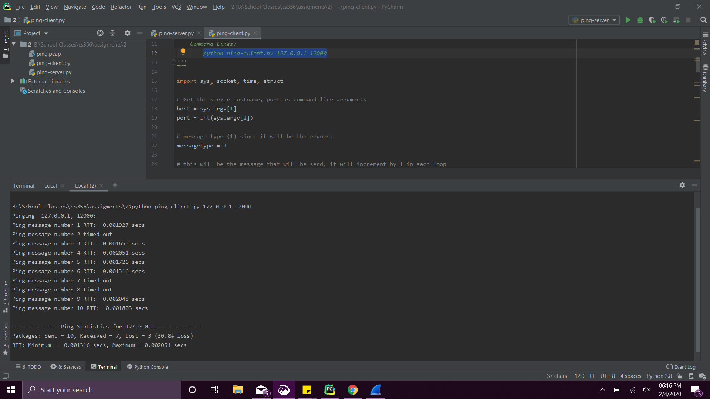
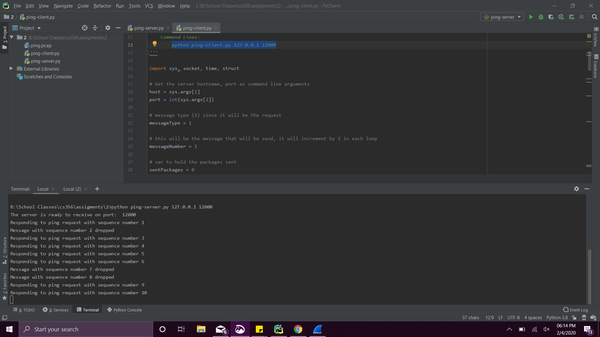

# ping
_This project is from my networking class_

The program has two files "ping-client.py" and "ping-server.py" that uses UDP sockets to determine
the round-trip time (RTT) to the server.

The message contains 2 4-byte integers and is encoded in network-byte order.

The client and server scripts take the parameters in command-line: 

- IP address of server
- IP port of server

The client script will read the input parameters, and send 10 ping requests
consecutively to the server. After each response is received, the client calculates
and prints the RTT for the message. If no response is received, the client notes that 
the request timed out and then sends the next request up to the maximum.

### Client

 

### Server
